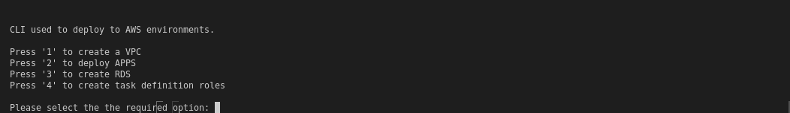
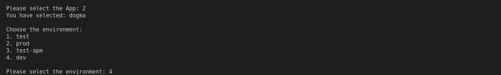
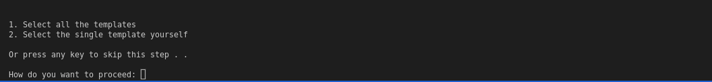

# CloudFormation

This repo contains the CloudFormation code that you can use to deploy a completely new environment.

## 1) Creating a New Environment
----
We are going to deploy CloudFormation templates using a python script named `aws_cf.py`. Before that, we'll have to install the dependencies.

## How to install the script dependencies and run the script

First, we'll need to install the script dependencies beforehand. You will need Python3 for this purpose. Run the following command to install the dependencies:

    pip3 install -r requirements.txt

Now run the script using the following command:

    python3 aws_cf.py

## Creating a new Environment for an Application

When you first run the script, you'll have multiple options on the screen which are as follows:



Here you have four options, one to create each resource. Now, select the `APPS` present on `Option-2` which will display the list of `Apps` as follows:  


Once you have selected your desired app, the script will prompt for the `environment` in which you want to create your application as shown: 



Once you select the desired environment, the script will make sure that a configuration file against the environment you have selected, exists inside a `conf` folder (For example, for a development environment, it can be named as `dev.json`):


After all your scripts have been uploaded, the next step after environment selection would be to deploy the selected application as shown below:



You can either run all the templates priority-wise or run a single template yourself. After that, the script will ask you whether you want to update/create or delete a template as shown:


Once you select the desired option, it will start update/create or delete a template as follows:


After the template gets deployed or deleted, the script will tell about the CloudFormation stack's status as shown:


## Addition of S3 Bucket for Each Application 
----
A new feature in our infrastructure is that we are creating `S3 Bucket` for the respective apps ( Dogma, Akita ). The script for creating the S3 Bucket is present under the `common/` directory.

## Configuration of S3 Bucket

For creating the S3 bucket for each application, simply add the below given `S3 Module` in the environment file of the application under the `apps/app_name/conf/` directory. The S3 bucket will be deployed first among all the stacks because it has the highest priority of `1` as written in the below code block.
```
   "S3":    {
        "_Priority": 1,
        "_Path" : "/common/s3.yml",
        "BucketName": "Your_Bucket_Name",
        "BucketAccessControl": "xxxx"
    }
```    

## Configuration of Environment File for an Application

The file environment file ( `test/prod.json` ) under `apps/app_name/conf/` directory consists of configurations that the script needs to run the CloudFormation templates. This file is read by the script and then, the script sends the parameters to your desired template as well as the path of your desired template gets selected here. Whenever we want to create a new template or want to update a template, we need to work on this JSON file. You can also create JSON files for different environments i.e, `dev.json`. There are two main things that you need to keep in mind: `_path` and `parameters`.

1) `_path key`, is primarily the path for your cloud formation template. We are directing to go and fetch template files from this path.

2) All the parameters that you are going to use in the CloudFormation templates are defined here in this file. you can see parameters for all the templates passing from here.

```
{
    "Region_ID": "xx-xxxx-xx",
    "Bucket_URI" : "https://**Bucket_Name**.s3.us-west-2.amazonaws.com/App_Name/",
    "BucketName": "Bucket_Name/App_Name/",
    "Environment": "Preferred_Environment",
    "Identifier": "Preferred_Identifier",
    "ALB" : {
        "_Priority" : 1,
        "_Path" : "/templates/alb.yml",
        "VPCId": "vpc-xxx",
        "PublicSubnets": "subnet-xxx,subnet-xxx,subnet-xxx",
        "SecurityGroups": "sg-xxx,sg-xxx,sg-xxx,sg-xxx"
    },
    "Route53" : {
        "_Priority" : 2,
        "_Path" : "/templates/route53.yml",
        "HostedZoneId": "xxxx",
        "HostName": "yourhostname.com"
    },
    "ECS" : {
        "_Priority": 3,
        "_Path" : "/templates/ecs.yml"
    },
    "Service" : {
        "_Priority": 4,
        "_Path" : "/templates/fargate.yml",
        "Tag": "Any_Preferred_Tag",
        "ContainerPort": "xxxx",
        "Path": "/",
        "ContainerName": "xxxx",
        "ServiceName": "xxxx",
        "ImageURI": "AccountID.dkr.ecr.us-west-2.amazonaws.com/image_path/",
        "TaskRoleARN": "arn:aws:iam::AccountID:role/Application_Task_Role",
        "BucketName": "{Bucket_URI}",
        "VPCId": "vpc-xxxx",
        "PrivateSubnets": "subnet-xxxx,subnet-xxxx",
        "SecurityGroups": "sg-xxxx,sg-xxxx,sg-xxxx",
        "FlaskEnv": "Desired_environment",
        "LoadGenomeStateMachine": "arn:aws:states:us-west-2:329245541944:stateMachine:GenbankToNeptuneStateMachine-QYf9VB6W0Nbk",
        "Priority": "12",
        "DesiredCount": "Your_Desired_Count",
        "CPUUnits": "Cpu_Units_in_Integer",
        "MemoryUnits": "Memory_Units_in_Integer"
    }
}
```

# 2) VPC
----
When you first run the script, you'll have multiple options on the screen which are as follows:


Once we select the desired resource which in this case would be `VPC`, the script will prompt for the environment as shown:


Once you select the desired environment, the script will make sure that a configuration file against the environment you have selected, exists inside a `conf` folder (For example, for a development environment, it can be named as `dev.json`): 


After all your scripts have been uploaded, the next step after environment selection would be to deploy the selected application as follows:
 


Now, you have three options for creation/update, deletion, and viewing outputs of the Vpc resource respectively:

- Press `1` to Create/Update the stack which includes creating a vpc from scratch OR updating a vpc.
- Press `2` to Delete the vpc stack already created.
- Press `3` to view outputs of the vpc stack which includes a tabular view of `Vpc-Id, Subnet-IDs, SecurityGroup-IDs`.

After the template gets deployed or deleted, the script will tell about the CloudFormation stack's status as shown:


## Output of Vpc Block

Once you have deployed the Vpc, a table will be displayed which will show necessary attributes with their values needed to be used in the environment file ( `sandbox.json` ) configuration. The table below is a replica of vpc's output table displayed in real-time. 


**VPC Output**
| ResourceName   | ResourceValue|
| -----------    | -----------  |
| VpcId          | vpc-xxx      |
| PublicSubnet1  | subnet-xxx   |
| PrivateSubnet1 | subnet-xxx   |
| SecurityGroup1 | sg-xxx       |

 
## Configuration of Environment File for Vpc

The environment file which in this case is `sandbox.json` under `infra/vpc/conf/` directory consists of configurations that the script needs to run the CloudFormation templates. This file is read by the script and then, the script sends the parameters to your desired template as well as the path of your desired template gets selected here. Whenever we want to create a new template or want to update a template, we need to work on this JSON file. You can also create JSON files for different environments i.e, `dev.json`. There are two main things that you need to keep in mind: `_path` and `parameters`.

1) `_path key`, is primarily the path for your cloud formation template. We are directing to go and fetch template files from this path.

2) All the parameters that you are going to use in the CloudFormation templates are defined here in this file. you can see parameters for all the templates passing from here.

```
{
    "Region_ID": "xx-xxxx-xx",
    "Bucket_URI" : "https://**Bucket_Name**.s3.us-west-2.amazonaws.com/App_Name/",
    "BucketName": "Bucket_Name/App_Name/",
    "Environment": "Preferred_Environment",
    "Identifier": "Preferred_Identifier",    
    "VPC" : {
        "_Priority" : 2,
        "_Path" : "/templates/vpc.yml",
        "VpcCidrBlock": "x.x.x.x/x", 
        "_subnets" : [{
            "Public":[
                {
                    "CidrBlock": "x.x.x.x/x",
                    "AvailabilityZone": "xx-xxxx-xx"
                }
            ],
            "Private":[
                {
                    "CidrBlock": "x.x.x.x/x",
                    "AvailabilityZone": "us-xxxx-xx"
                }
            ]
        }],
        "_securitygroup": [{
            "ResourceName": "SecurityGroup01",
            "GroupDescription": "This is the description of group",
            "GroupName": "SgGroupName",
            "inbound":[
                {
                    "CidrIp": "x.x.x.x/x",
                    "IpProtocol": "xxx",
                    "FromPort": "xxxx",
                    "ToPort": "xxxx",
                    "Description": "'Allow Port'"
                },
                {
                    "CidrIpv6": "::/x",
                    "SourceSecurityGroupId": "",
                    "IpProtocol": "xxx",
                    "FromPort": "xxxx",
                    "ToPort": "xxxx",
                    "Description": "'Allow Port'"
                },                
                {
                    "SourceSecurityGroupId": "sg-xxxx",
                    "IpProtocol": "xxx",
                    "FromPort": "xxxx",
                    "ToPort": "xxxx",
                    "Description": "'Allow Port'"
                }                
            ],
            "outbound":[
                {
                    "CidrIp": "x.x.x.x/x",                   
                    "IpProtocol": "xxx",
                    "FromPort": "xxxx",
                    "ToPort": "xxxx",
                    "Description": "'Allow Port'"
                },
                {
                    "CidrIpv6": "::/x",                    
                    "IpProtocol": "xxx",
                    "FromPort": "xxxx",
                    "ToPort": "xxxx",
                    "Description": "'Allow Port'"
                },                
                {
                    "DestinationSecurityGroupId": "sg-xxxx",
                    "IpProtocol": "xxx",
                    "FromPort": "xxxx",
                    "ToPort": "xxxx",
                    "Description:": "Allow Port"
                }
            ]
            
        }
    ]
    }

}
```


## Configuration of Values in Environment File

The environment file consists of the priority of each resource and every resource has its defined priority and it will get deployed accordingly. The table below shows mandatory attributes needed to be configured in the environment file and how they should be configured:

**Resource Name: Vpc** 

The Vpc block consists of a particular `VpcCidrBlock` defined in the environment file along with subnets and security groups as follows:
| Property-Name                        | Description              | Value              | Type          |
| :---                                 | :----                    | :---               | :---          |
| VpcCidrBlock | The primary IPv4 CIDR block for the VPC          | x.x.x.x/x         | String |


**Resource Name: Subnets**  

Contains a `List` of `Public` and `Private` Subnets defined individually in the environment file. Both, public and private subnet's lists have below mentioned attributes:
| Property-Name                        | Description              | Value              | Type          |
| :---                                 | :----                    | :---               | :---          |
| CidrBlock | The IPv4 CIDR block assigned to the subnet          | x.x.x.x/x         | String |
| AvailabilityZone |  availability zone in which you want subnet to be  | us-west-xx | String |     


**Resource Name: Security Group** 

Contains a `List` of security groups while each security group has it's own set of `Inbound` and `Outbound` rules defined in the environment file:
| Property-Name                        | Description              | Value              | Type          |
| :---                                 | :----                    | :---               | :---          |
| GroupDescription | A description for the security group. This is informational only | Security Group for Database | String|
| GroupName              | The name of the security group | Postgres-SecurityGroup | String |
|**Inbound Rules For Security Group**|
| Description | A description for the security group rule. | Up to 255 characters in length. Allowed characters are a-z, A-Z, 0-9, spaces, and ._-:/()#,@[]+=;{}!$* | String |
| CidrIp | The IPv4 address range, in CIDR format.You must specify a SourceSecurityGroupId  or a CIDR range | x.x.x.x/x | String |
| CidrIpv6 | The IPv6 address range, in CIDR format.You must specify a SourceSecurityGroupId  or a CIDR range (CidrIp or CidrIpv6) | ::/x | String |
| SourceSecurityGroupId | The ID of the security group. You must specify either the security group ID or the security group name in the request.| sg-xxxx | String |
| IPProtocol | The IP protocol name (tcp, udp, icmp, icmpv6) or number | tcp/udp | String |
| FromPort | The start of port range for the TCP and UDP protocols, or an ICMP/ICMPv6 type number. | A specfic port like `3306` for `mysql`. Value of -1 indicates all ICMP/ICMPv6 types.  | Integer |
| ToPort                   | The end of port range for the TCP and UDP protocols, or an ICMP/ICMPv6 code. | A specfic port like `80` for `http`. Value of -1 indicates all ICMP/ICMPv6 types. | Integer|
|**Outbound Rules For Security Group**|
| Description | A description of the security group rule. | Up to 255 characters in length. Allowed characters are a-z, A-Z, 0-9, spaces, and ._-:/()#,@[]+=;{}!$* | String |
| CidrIp | The IPv4 address range, in CIDR format.You must specify a SourceSecurityGroupId  or a CIDR range | x.x.x.x/x | String |
| CidrIpv6 | The IPv6 address range, in CIDR format.You must specify a destination security group (DestinationPrefixListId or DestinationSecurityGroupId) or a CIDR range (CidrIp or CidrIpv6) | ::/x | String |
| DestinationSecurityGroupId | The ID of the security group. You must specify either the security group ID or the security group name in the request.| sg-xxxx | String |
| IpProtocol | The IP protocol name (tcp, udp, icmp, icmpv6) or number | tcp/udp | String |
| FromPort | The start of port range for the TCP and UDP protocols, or an ICMP/ICMPv6 type number. | A specific port like `3306` for `mysql`. Value of -1 indicates all ICMP/ICMPv6 types.  | Integer |
| ToPort                   | The end of port range for the TCP and UDP protocols, or an ICMP/ICMPv6 code. | A specfic port like `80` for `http`. Value of -1 indicates all ICMP/ICMPv6 types. | Integer|


# 3) IAM Role  
----
A new feature in our infrastructure is that we are creating IAM roles for the respective apps ( Dogma, Akita ) in the `infra` block. 
When you first run the script, you'll have multiple options on the screen which are as follows:


Once we select the desired resource which in this case would be `Task definition Role`, the script will prompt for the environment as shown:


Once you select the desired environment, the script will make sure that a configuration file against the environment you have selected, exists inside a `conf` folder (For example, for a production environment, it can be named as `prod.json`): 


After all your scripts have been uploaded, the next step after environment selection would be to deploy the selected application as follows:
 


Now, you have three options for creation/update, deletion, and viewing outputs of the IAM resource respectively:

- Press `1` to Create/Update the stack which includes creating an IAM Role from scratch OR updating it.
- Press `2` to Delete the IAM Role stack already created.
- Press `3` to view outputs of the stack which includes a tabular view of a created `IAM Role` with its `Amazon Resource Name (ARN)`.

After the template gets deployed or deleted, the script will tell about the CloudFormation stack's status as shown:


## Output of IAM Role

Once this stack is deployed successfully, task definition IAM roles with their `Amazon Resource Names (ARNs)` will be visible in the terminal in a table format as shown in the table below. IAM Roles are present under `infra/tasks/templates/` directory. 

**IAM Role  Output**
| ResourceName   | ResourceValue|
| -----------    | -----------  |
| ApplicationTaskDefinitionRole           |  arn:aws:iam::account_id:role/applicationtaskdefinitionrole      |


## Configuration of Environment File for IAM Roles

The environment file which in this case is `prod.json` under `infra/tasks/conf/` directory consists of configurations that the script needs to run the CloudFormation templates. This file is read by the script and then, the script sends the parameters to your desired template as well as the path of your desired template gets selected here. Whenever we want to create a new template or want to update a template, we need to work on this JSON file. You can also create JSON files for different environments i.e, `dev.json`. There are two main things that you need to keep in mind: `_path` and `parameters`.

1) `_path key`, is primarily the path for your cloud formation template. We are directing to go and fetch template files from this path.

2) All the parameters that you are going to use in the CloudFormation templates are defined here in this file. you can see parameters for all the templates passing from here.

```
{
    "Region_ID": "xx-xxxx-xx",
    "Bucket_URI" : "https://**Bucket_Name**.s3.us-west-2.amazonaws.com/App_Name/",
    "BucketName": "Bucket_Name/App_Name/",
    "Environment": "Preferred_Environment",
    "Identifier": "Preferred_Identifier",    
    "DogmaTaskDefinitionRole":    {
        "_Priority": 1,
        "_Path" : "/templates/DogmaTaskDefRole.yml"
    },    
    "AkitaTaskDefinitionRole":    {
        "_Priority": 1,
        "_Path" : "/templates/AkitaTaskDefRole.yml"
    }
}
```


# 4) RDS 
----
When you first run the script, you'll have multiple options on the screen which are as follows:


Once we select the desired resource which in this case would be `RDS`, the script will prompt for the environment as shown:


Once you select the desired environment, the script will make sure that a configuration file against the environment you have selected, exists inside a `conf` folder (For example, for a production environment, it can be named as `prod.json`): 


After all your scripts have been uploaded, the next step after environment selection would be to deploy the selected application as follows:
 


Now, you have three options for creation/update, deletion, and viewing outputs of the RDS resource respectively:

- Press `1` to Create/Update the stack which includes creating an RDS from scratch OR Creating it from `DBSnapshot`.
- Press `2` to Delete the RDS stack already created.
- Press `3` to view outputs of the stack which includes a tabular view of important RDS attributes.

After the template gets deployed or deleted, the script will tell about the CloudFormation stack's status as shown:


## Output of RDS Block

Once you have deployed the RDS, a table will be displayed which will show necessary attributes with their values needed to be used in the environment file ( `sandbox.json` ) configuration. The table below is a replica of RDS's output table displayed in real-time. 


**RDS Output**
| ResourceName   | ResourceValue|
| -----------    | -----------  |
| DatabaseEndpoint          | db-xxx      |
| DatabaseEngine  | xxxx   |
| DatabaseName | xxxx   |
| DatabaseSecurityGroup | sg-xxx       |
| DatabaseUserName  | xxxx   |
| EndpointandPort | xxx-xxx-xxx       |


## Configuration of Environment File for RDS

The environment file ( `sandbox.json` ) under `infra/rds/conf/` directory consists of configurations that the script needs to run the CloudFormation templates. This file is read by the script and then, the script sends the parameters to your desired template as well as the path of your desired template gets selected here. Whenever we want to create a new template or want to update a template, we need to work on this JSON file. You can also create JSON files for different environments i.e, `dev.json`. There are two main things that you need to keep in mind: `_path` and `parameters`.

1) `_path key`, is primarily the path for your cloud formation template. We are directing to go and fetch template files from this path.

2) All the parameters that you are going to use in the CloudFormation templates are defined here in this file. you can see parameters for all the templates passing from here.

```
{
    "Region_ID": "xx-xxxx-xx",
    "Bucket_URI" : "https://**Bucket_Name**.s3.us-west-2.amazonaws.com/App_Name/",
    "BucketName": "Bucket_Name/App_Name/",
    "Environment": "Preferred_Environment",
    "Identifier": "Preferred_Identifier",
    "RDS" : {
        "_Priority": x,
        "_Path" : "/templates/xxx.yml",
        "DBSnapshotName": "",
        "DBAllocatedStorage": "x",
        "DBInstanceClass": "x.x.x",
        "DBName": "",
        "DBBackupRetentionPeriod": "x",
        "DBMasterUsername": "xxxxx",
        "DBMasterUserPassword": "xxxxxxxx",
        "DatabaseEngine": "xxxxx",
        "EngineVersion": "xxxxx"        
        "DBMultiAZ": "xxxx",
        "DeleteAutomatedBackups": "xxxx",
        "DeletionProtection": "xxxx",
        "EnablePerformanceInsights": "xxxx",
        "PreferredBackupWindow": "xx:xx-xx:xx",
        "PreferredMaintenanceWindow": "xx:xx:xx-xx:xx:xx",
        "PubliclyAccessible": "xxxx",
        "EnableIAMDatabaseAuthentication": "xxxx",
        "StorageType": "xxx",
        "UseDefaultProcessorFeatures": "xxxx",
        "VPCId": " vpc-xxx",
        "Subnets": "subnet-xxxx,subnet-xxxx",
        "DatabaseSecurityGroup": "sg-xxxx,sg-xxxxx",        
        "DBEncryptionKmsAlias": ""
    }
}
``` 


## Configuration of Values in Environment File

The environment file consists of the priority of each resource and every resource has its defined priority and it will get deployed accordingly. The table below shows mandatory attributes needed to be configured in the environment file and how they should be configured. 

**RDS Configuration** 
| Property-Name  | Description              | Value              | Type          |
| :---           | :----                    | :---               | :---          |
| DBSnapshotName | snapshot from which you want to restore (leave blank to create an empty database)                                   | Snapshot present in Rds e.g 'postgres-snapshot-1'        | String   |
| DBAllocatedStorage | Allocated storage in GB (ignored when DBSnapshotIdentifier is set)|your preferred value e.g 5 (means 5 GB Storage)| Number |
| DBInstanceClass | The instance type of database server. | your preferred DbClass e.g 'db.t3.medium' | String |
| DBName | The database name (Not to mention when DBSnapshotIdentifier is set) | your preferred name e.g 'postgresdb' | String      |
| DBMasterUsername | The database admin account username(Not to mention when DBSnapshotIdentifier is set) | your preferred name e.g 'admin' | String|
| DBMasterUserPassword | The database admin account password | must have atleast 8 letters e.g '12345678' | String |
| InstanceIdentifier | A name for the DB instance.If you don't specify a name, AWS CloudFormation generates a unique physical ID and uses that ID for the DB instance.| your preferred DBinstanceidentifier e.g 'my-postgres-db'| String|
| DBBackupRetentionPeriod | The number of days to keep snapshots of the database. | Must be a value from 0 to 35 | Integer|
| DBMultiAZ | Specifies if the database instance is deployed to multiple Availability Zones for High Availablity| choose a value from [true, false]   | String |
| DatabaseEngine | Database Engine version | choose a value from [postgres, mysql, aurora-mysql, aurora] | String |
| EngineVersion | The version number of the database engine to use| Specify an Engine value for a database e.g 5.6 for mysql| String|
| DeleteAutomatedBackups | Specifies if the database backup should be deleted (Not to mention when DBSnapshotIdentifier is set)| choose a value from [true, false]| String|
| DeletionProtection | Specifies if the database should be deleted| choose a value from [true, false]| String|
| EnablePerformanceInsights | Specifies if the Performance Insights should be enabled? (Not to mention when DBSnapshotIdentifier is set)|choose a value from [true, false] |String|
| PreferredBackupWindow | The daily time range in UTC during which you want to create automated backups| Must be in the format hh(24):mi-hh(24):mi |String |
| PubliclyAccessible |Specifies if the DB Public Access should be enabled? | choose a value from [true, false] | String|
| EnableIAMDatabaseAuthentication | Enable mapping of AWS Identity and Access Management (IAM) accounts to database accounts| choose a value from [true, false]| String |
| StorageType | Storage Type of DB-Instance.| AllowedValues to choose from are: ['standard', 'gp2', 'io1'] | String
| UseDefaultProcessorFeatures | Indicates whether the DB instance class of the DB instance uses its default processor features| choose a value from [true, false]| String|
| VPCId | Create a security group in this respective VPC| Specify vpc id: vpc-xxxx| String |
| Subnets | List of Subnets(Private/Public) for the database which will be Comma Seperated| Specify subnets in a list: subnet-xxxx, subnet-xxxx| String|
| DatabaseSecurityGroup | List of Database Security Group which will be Comma Seperated | Specify list of security groups : sg-xxxx, sg-xxxx| String|
| DBEncryptionKmsAlias | The alias for Key Management Service encryption key alias | Default is empty as encryption is OFF | String|


