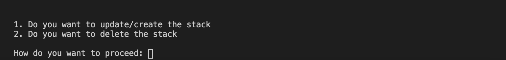

# CloudFormation

This repo contains the CloudFormation code that you can use to deploy a completely new environment.

## Creating a new Environment

We are going to deploy cloudformation templates using python script named as `aws_cf.py`. Before that, we'll have to install the dependencies

### 1) How to install the script dependencies and run the script

First we'll need to install the script dependencies beforehand. Run the following command to install the dependencies.

    pip3 install -r requirements.txt

Now run the script using the following command.

    python3 aws_cf.py

First of all, script will prompt for environment, and once you select the desired environment, script will make sure that a configuration file against the environment you have selected, exists inside a `conf` folder (For production, it will be named as `production.json`.)


It will ask for confirmation, you can cancel it if you want to. After confirmation all the templates will uploaded to s3 bucket.


You can either run all the templates priority wise or run a single template yourself.


After that, script will ask you whether you want to update/create or delete a template.


Once you select the desired options, it will start update/create or delete a template.


After template gets deployed or deleted, script will let you know



### 2) Configuration production.json file

This file consist of confiugrations that script needs to run the cloudformation templates. This file is read by the script and then script sends the parameters to your desired template as well as the path of your desired template is got selected by here. Whenever we want to create a new template or want to update a template we need to work on this json file. There are 2 main things that you need to keep in mind _path and parameters.

1) _path key, it is the basically path for your cloudformation template. We are telling here go and fetch template file from this path.

2) All the parameters that you are going to use in the cloudformation templates defined here in this file. you can see parameters for all the  templates passing from here.

```
{
    "Region_ID": "us-west-2",
    "Bucket_URI" : "https://cf-templates-1mhd4gm8nbj46-us-west-2.s3.us-west-2.amazonaws.com/dogma/",
    "BucketName": "cf-templates-1mhd4gm8nbj46-us-west-2/dogma/",
    "Environment": "production",
    "Identifier": "pendulumn",
    "ALB" : {
        "_Priority" : 1,
        "_Path" : "/templates/alb.yml",
        "VPCId": "vpc-bc9b15d7",
        "PublicSubnets": "subnet-b19b15da,subnet-b29b15d9,subnet-b39b15d8",
        "SecurityGroups": "sg-01ab7ccb91665b723,sg-06f996f3d5ac3c6e8,sg-0a659065,sg-48149e2f"
    },
    "Route53" : {
        "_Priority" : 2,
        "_Path" : "/templates/route53.yml",
        "HostedZoneId": "Z1L31BET9POS2B",
        "HostName": "dogma-ecs.wholebiome.com"
    },
    "ECS" : {
        "_Priority": 3,
        "_Path" : "/templates/ecs.yml"
    },
    "Service" : {
        "_Priority": 4,
        "_Path" : "/templates/fargate.yml",
        "Tag": "latest",
        "ContainerPort": "3031",
        "Path": "/",
        "ContainerName": "dogma",
        "ServiceName": "dogma",
        "ImageURI": "329245541944.dkr.ecr.us-west-2.amazonaws.com/dogma/server",
        "TaskRoleARN": "arn:aws:iam::329245541944:role/Dogma-production-server-role",
        "BucketName": "{Bucket_URI}",
        "VPCId": "vpc-bc9b15d7",
        "PrivateSubnets": "subnet-029d78277c38ae8e2,subnet-03b1dbdc65580b33d",
        "SecurityGroups": "sg-01ab7ccb91665b723,sg-06f996f3d5ac3c6e8,sg-48149e2f",
        "FlaskEnv": "production",
        "LoadGenomeStateMachine": "arn:aws:states:us-west-2:329245541944:stateMachine:GenbankToNeptuneStateMachine-QYf9VB6W0Nbk",
        "Priority": "12",
        "DesiredCount": "1",
        "CPUUnits": "512",
        "MemoryUnits": "1024"
    }
}
```
